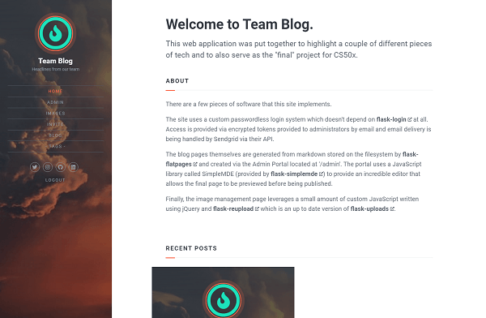
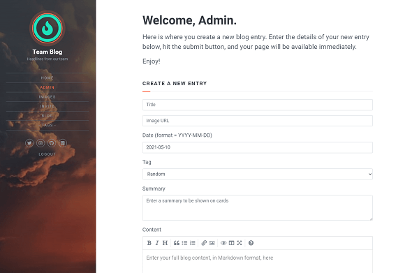
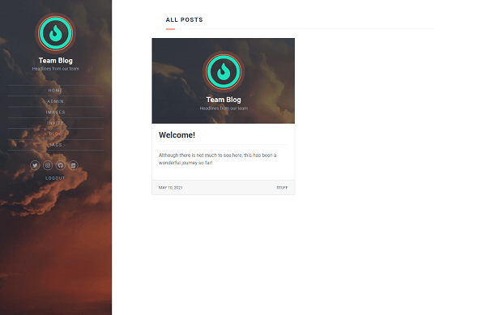
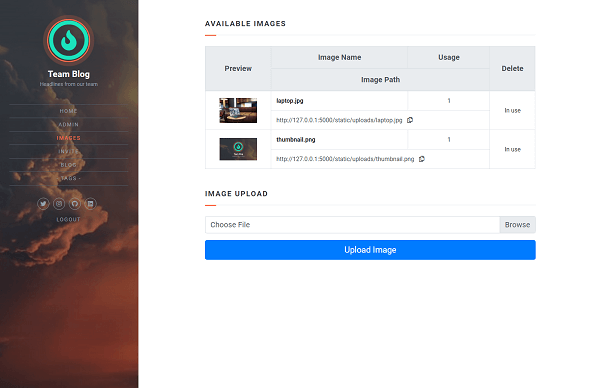

# Team Blog
Team Blog is a small Flask application that provides a means for a team of bloggers to create and manage a public blog.

## Features

### Custom passwordless authentication

While most Flask applications use an authenticaton system based on [flask-login](https://flask-login.readthedocs.io/), I wanted to implement a passwordless system.  Rather than require a local password to be stored or to depend on a third-party OAuth system, access is provided via encrypted tokens delivered by email.   Email delivery, in this implementation, is now being provided by [Resend's API](https://resend.com/docs/send-with-flask).

### Markdown generated HTML blog pages

The blog pages themselves are generated from markdown stored on the filesystem using [flask-flatpages](https://flask-flatpages.readthedocs.io/).  This markdown, and the associated metadata required to properly manage those pages, is created via the custom Admin page located at '/admin'. (Since accounts are "closed" to only invited team members, the admin page is not linked from the main website.)

The admin page uses a JavaScript library called [SimpleMDE](https://simplemde.com/) (provided by [flask-simplemde](https://flask-simplemde.readthedocs.io/)) to provide an incredible editor that allows the final page to be previewed before being published.

### Image file management

Finally, the image management page leverages a small amount of custom JavaScript written using jQuery and [flask-reupload](https://github.com/jugmac00/flask-reuploaded) (an up to date version of [flask-uploads](https://pythonhosted.org/Flask-Uploads/)).  Although the original project does appear to still be active, the maintainer has decided to no longer publish up to date project files to Pypi.  The flask-reupload project has expanded upon the original work, while maintaining backwards compatibility, and provides the updated extension via Python package to make it easy to incorporate into your project.

## Screenshots

### Landing Page

### Admin Page

### Blog Cards

### Image Management

## Other Resources

Although a number of tools have already been mentioned, there were also a few tutorials that were helpful in completing this project.  Those tutorials were:

* [Dead easy yet powerful static website generator with Flask](https://nicolas.perriault.net/code/2012/dead-easy-yet-powerful-static-website-generator-with-flask/)
* [Handling File Uploads With Flask](https://blog.miguelgrinberg.com/post/handling-file-uploads-with-flask)
* [Creating a Copy to Clipboard Button with Bootstrap](http://davidzchen.com/tech/2016/01/19/bootstrap-copy-to-clipboard.html)
* [Responsive HTML emails by leemunroe on Github](https://github.com/leemunroe/responsive-html-email-template)
 
The entire website has been implemented using [Flask](https://flask.palletsprojects.com/en/1.1.x/), [Flask-WTF](https://flask-wtf.readthedocs.io/), and [Bootstrap 4](https://getbootstrap.com/), but was designed based on a template created for Jamstack with Stackbit:

* [Stackbit Fresh](https://themes.stackbit.com/demos/fresh/)

## Future Improvements

* The app is complicated enough and already organized around three "functions" (blog, admin, image management).  Migrating those pieces into blueprints would make future application development easier to manage.
* This Flask app was designed using the "traditional" app.py pattern but would potentially benefit from being implemented using the "factory pattern".
* Having implemented passwordless authentication, creating an extension from it would improve its use in future projects.
* It is currently possible to view blog entries by date and by tag but not by author.
